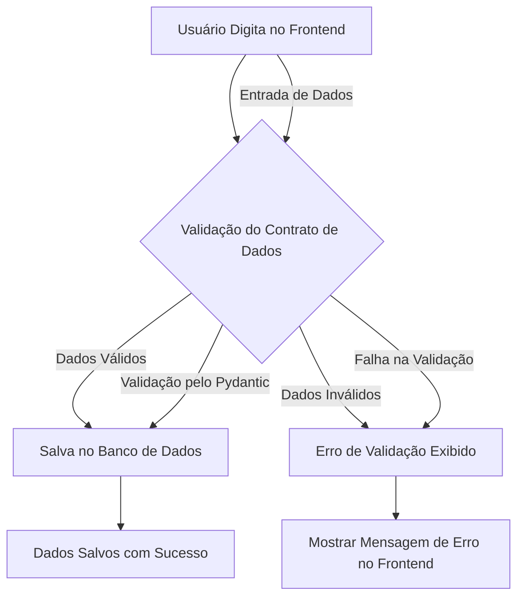

### **Documento de Requisitos com Validações - Sistema de CRM e Vendas da ZapFlow**

---

#### **Objetivo**
O objetivo deste documento é definir os requisitos funcionais e as validações necessárias para o desenvolvimento do frontend do Sistema de CRM e Vendas da ZapFlow, desenvolvido com Streamlit. O sistema visa capturar informações sobre vendas realizadas, validá-las e exibi-las na tela.

---

Aqui está o diagrama em Mermaid que descreve o fluxo de dados desde a entrada do usuário no frontend até a validação dos dados e o salvamento no banco de dados, se aprovado.

### **Descrição do Diagrama:**

1. **Usuário Digita no Frontend:**
   - O usuário insere os dados necessários no frontend do sistema.

2. **Validação do Contrato de Dados:**
   - Os dados inseridos são validados usando o modelo Pydantic (contrato de dados) para garantir que estejam no formato correto e dentro das regras especificadas.

3. **Dados Válidos:**
   - Se os dados forem válidos, eles são enviados para o banco de dados e salvos.

4. **Dados Inválidos:**
   - Se os dados não atenderem aos critérios de validação, uma mensagem de erro é gerada e exibida no frontend.

5. **Salvar no Banco de Dados:**
   - Após a validação, os dados são persistidos no banco de dados.

6. **Exibição de Mensagens:**
   - Exibe uma mensagem de sucesso quando os dados são salvos corretamente, ou uma mensagem de erro quando há falhas na validação.

Esse diagrama mostra o fluxo completo desde a entrada até o salvamento dos dados, detalhando o processo de validação essencial para manter a integridade do sistema.

---

#### **Requisitos Funcionais e Validações**

1. **Título do Sistema**
   - **Descrição:** O sistema deve exibir o título "Sistema de CRM e Vendas da ZapFlow - Frontend Simples" no topo da página.
   - **Justificativa:** Identificar claramente o sistema e sua finalidade para o usuário.

2. **Campos de Entrada de Dados**
   - O sistema deve fornecer campos para inserção de dados da venda. Cada campo deve ser claramente identificado e deve aceitar o tipo de entrada correto conforme descrito abaixo, com as respectivas validações.

   ##### **Detalhamento dos Campos e Validações**

   1. **Email do Vendedor**
      - **Descrição:** Campo de texto para inserção do email do vendedor.
      - **Tipo de Entrada:** `text_input` (String)
      - **Validação Esperada:**
        - Deve ser um email válido no formato padrão (ex: `vendedor@exemplo.com`).
        - Verificar se o campo não está vazio.
      - **Exemplo de Uso:** O usuário insere um email válido, como `vendedor@exemplo.com`.

   2. **Data da Compra**
      - **Descrição:** Campo para selecionar a data em que a venda foi realizada.
      - **Tipo de Entrada:** `date_input` (Data)
      - **Valor Padrão:** A data atual (`datetime.now()`).
      - **Validação Esperada:**
        - A data deve estar dentro do intervalo permitido: entre `01/09/2024` e `12/09/2024`.
        - Não permitir datas fora do intervalo especificado.
      - **Exemplo de Uso:** O usuário seleciona uma data como `05/09/2024`.

   3. **Hora da Compra**
      - **Descrição:** Campo para selecionar a hora em que a venda foi realizada.
      - **Tipo de Entrada:** `time_input` (Hora)
      - **Valor Padrão:** 09:00 (hora inicial padrão).
      - **Validação Esperada:** 
        - A hora deve ser inserida dentro do intervalo de 09:00 às 17:00.
      - **Exemplo de Uso:** O usuário seleciona `10:30`.

   4. **Valor da Venda**
      - **Descrição:** Campo numérico para inserir o valor monetário da venda realizada.
      - **Tipo de Entrada:** `number_input` (Float)
      - **Valor Mínimo:** 0.0 (não são permitidos valores negativos).
      - **Formato:** Decimal com duas casas (`format="%.2f"`).
      - **Validação Esperada:** 
        - Deve ser um número positivo maior que zero.
        - Deve estar no formato monetário adequado com duas casas decimais.
      - **Exemplo de Uso:** O usuário insere `1500.00`.

   5. **Quantidade de Produtos**
      - **Descrição:** Campo numérico para inserir a quantidade de produtos vendidos.
      - **Tipo de Entrada:** `number_input` (Inteiro)
      - **Valor Mínimo:** 1 (quantidade mínima permitida).
      - **Passo:** Incremento de 1 unidade por ajuste.
      - **Validação Esperada:**
        - Deve ser um número inteiro positivo.
        - Não deve ser zero ou negativo.
      - **Exemplo de Uso:** O usuário insere `3`.

   6. **Produto**
      - **Descrição:** Campo de seleção para escolher o produto vendido.
      - **Tipo de Entrada:** `selectbox` (Seleção)
      - **Opções Disponíveis:**
        - "ZapFlow com Gemini"
        - "ZapFlow com chatGPT"
        - "ZapFlow com Llama3.0"
      - **Validação Esperada:**
        - O produto selecionado deve ser uma das opções válidas.
        - Não permitir seleção de produtos fora das opções listadas.
      - **Exemplo de Uso:** O usuário seleciona "ZapFlow com chatGPT".

3. **Botão de Submissão**
   - **Descrição:** Um botão para salvar e exibir os dados inseridos na tela.
   - **Rótulo do Botão:** "Salvar"
   - **Comportamento:** Quando clicado, o sistema deve capturar os dados inseridos nos campos, validar as entradas e exibi-las na tela se todos os campos estiverem corretos.

4. **Exibição dos Dados**
   - **Descrição:** Após a submissão, o sistema deve exibir os dados capturados na tela.
   - **Formatos de Exibição:**
     - **Email do Vendedor:** Exibe o email inserido.
     - **Data e Hora da Compra:** Exibe a data e hora combinadas como `yyyy-mm-dd hh:mm:ss`.
     - **Valor da Venda:** Exibe o valor formatado como moeda, ex.: `R$ 1500.00`.
     - **Quantidade de Produtos:** Exibe a quantidade inserida.
     - **Produto:** Exibe o nome do produto selecionado.

---

#### **Notas**
- Este sistema captura e valida os dados antes de exibi-los, garantindo que todas as entradas estejam corretas conforme as regras definidas.
- Em versões futuras, o sistema poderá ser integrado com um backend para persistência dos dados e funcionalidades avançadas de análise e relatórios.

---

#### **Objetivo Futuro**
- Integrar validações avançadas para reforçar a integridade dos dados.
- Conectar o sistema a um banco de dados para armazenar vendas e gerar relatórios.
- Adicionar verificações adicionais para campos obrigatórios e dados duplicados.